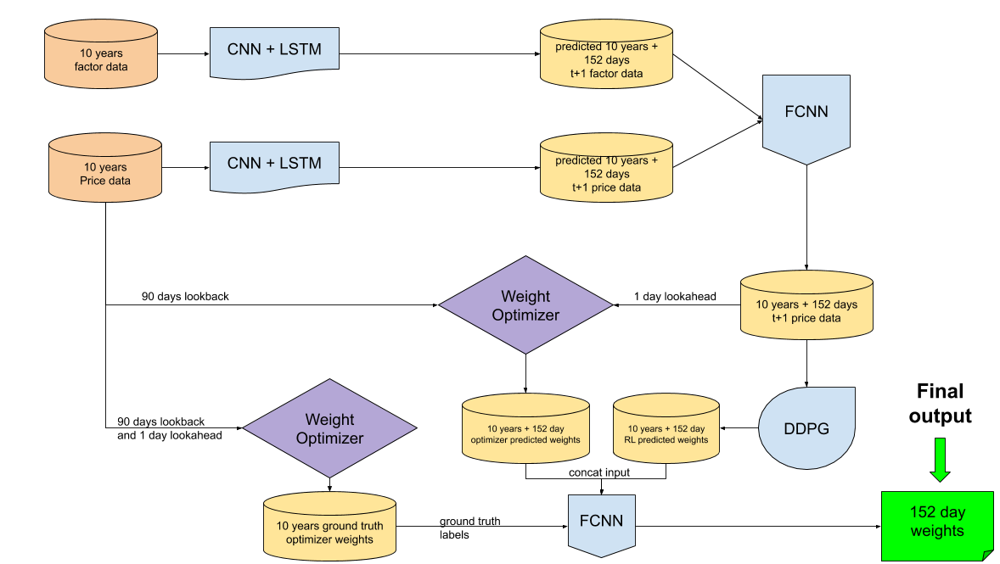

# Future Price Prediction Using Long-Short-Term-Memory and Portfolio Optimization using Deep Deterministic Policy Gradient And Risk Minimization with Respect to The First Two Statistical Moments

## Overview
Final project for Professor Iddo Drori's COMSW4775 - Deep Learning @ Columbia University.
- LSTM-CNN future stock price change and market factor prediction
- Reinforcement Learning agent for portfolio optimization using DDPG and min-variance optimization.
- Regressor to predict:
    - Price changes from LSTM predicted price change and market factor data
    - Optimal portfolio weights from RL DDPG chosen weights and conic optimizer on above regressor predictions

## Authors
- Eden Dolev
- Ben Segev
- Lingyu An

## Dependencies
### Required
- python 3.7
- pytorch 1.3.0
- gym 0.15.3
- numpy 1.17.2
- pandas 0.25.3
- scipy

### Optional
- comet_ml 2.0.16

## Overview
Before the competition was announced this was the focal point of the project. It is able to make portfolio optimization decisions for t+1 based on price information from t.
However, since the objective has changed with Kaggle to having to predict 152 days into the future, there's need to predict future prices which is not something an RL agent is designed to do.
We did adapt the agent to work optimization for the 152 predicted price data and try to optimize the portfolio. However, since in that case we already "know" the future prices (i.e. predicted prices) it becomes a closed optimization problem which we can use constraint optimization for.
We decided to use another regressor to help determine the weighting between the DDPG output and conic optimization output. 

## Architecture
### Components

Legend:
- orange: input data csv files
- yellow: interim output data csv files
- blue: deep learning and reinforcement learning models
- purple: conic optimizer
- green: final output (weights)

### How to use
See more specific instructions on how to run each component. This is an overview of how things fit together
1. Get X years of price change data and X years of market variable data (periods must match)
2. Feed both independently into LSTM (see below `prices_main.py`). These runs will produce two files with X years + k days of all predicted data
3. Feed both new predicted price change and market factor data csv files into fully connected regressor (see `estimator_main.py` below). This will generate the final predicted X years + k days price change data in a csv file
4. Feed price change data to RL agent (see `main.py` below). This will produce a new csv with predicted optimal weights for k days
5. Feed X years of original X year price change data and X years of predicted price change data from (3) into conic optimizer. This will generate predicted optimal weights for X years
6. Feed original X year price change data to conic optimizer to get optimal weights (see `optimizer_main.py` below). This will generate ground truth optimal weights for X years
7. Feed predicted optimal weights from DDPG in (4) and predicted optimal weights from conic optimizer in (5) into regressor (see `estimator_main.py` below again) and train with optimal weights from (6) as ground truth labels
8. Repeat steps 4 to 7 one more time with new predicted k days generated by regressor in (3)

## DDPG

### Overview
A reinforcement learning DDPG agent used to observe state (weights) and reward (gains/volatility)
and take actions (weights again) on a portfolio. Portfolio environment implemented using OpenAI Gym.
Takes price change data as input.

### How to run
Run `python main.py [...optional run args]`

### Run args
- dataset_name: name of dataset csv file in data dir
- data_dir
- lr: learning rate
- episodes: number of training episodes
- limit_days: limit data to days per episode (latest days in dataset)
- limit_iters: hard limit on total iterations (for debugging)
- num_sample_stocks: limit data to subset of stocks
- discount_factor: q learning discount factor
- minibatch_size: policy learning batch size
- warmup_iters: number of iterations for random action generation in the start of training (should be at least minbatch_size for effective learning)
- random_process_theta: theta hyperparameter for Ornstein Uhlenback Process for action noise
- log_interval: reporting interval
- log_comet: use comet ml for datalogging [True/False]
- comet_tags: tags for comet ml
- force_cpu: force pytorch to use cpu even if cuda available [True/False]
- results_root_dir: directory to save results in
- checkpoints_root_dir: directory to save checkpoints in
- checkpoints_interval: interval at which to save checkpoints
- save_checkpoints: save checkpoints [True/False]
- load_model: load model path
- modes: combination of [test/train]
- plot_stocks: plot graph of stock prices [True/False]
- visualize_portfolio: visualize portfolio holdings per epoch [True/False]

## LSTM-CNN

### Overview
We use this ResNet34 LSTM twice (independently) to once predict future prices and a second time predict future market variables for k days in the future.
It has a configurable lookback window of days and several other tunable hyper parameters.

### How to run
Run `python prices_main.py [...optional run args]`

### Run args
- dataset_name: name of dataset csv file in data dir
- data_dir
- lr: learning rate
- epochs: number of training epochs
- limit_days: limit data to days per episode (latest days in dataset)
- val_days: number of days to use as validation set
- target_size: if target size is different from input size
- days_lookback_window: days to use for sliding LSTM lookback window
- test_predict_days: number of days to predict/generate after final input day
- num_sample_stocks: limit data to subset of stocks
- batch_size: learning batch size
- log_interval: reporting interval
- log_comet: use comet ml for datalogging [True/False]
- comet_tags: tags for comet ml
- force_cpu: force pytorch to use cpu even if cuda available [True/False]
- results_root_dir: directory to save results in
- checkpoints_root_dir: directory to save checkpoints in
- checkpoints_interval: interval at which to save checkpoints
- save_checkpoints: save checkpoints [True/False]
- load_model: load model path
- modes: combination of [test/train]
- log_interval: interval to log at batch level
- log_batches: log at batch level [True/False]
- log_epochs: log at epoch level [True/False]

## Regression Estimator

### Overview
Fully connected NN regressor which is used for two purposes:
1. Take concatenated LSTM predicted price change data and market variable data as input, and predict price change
2. Take concatenated DDPG predicted weights data and conic optimized LSTM predicted price change data as input, and predict optimal weights 

### How to run
Run `python estimator_main.py [...optional run args]`

### Run args
- dataset_name: name of dataset csv file in data dir
- data_dir
- lr: learning rate
- epochs: number of training epochs
- limit_days: limit data to days per episode (latest days in dataset)
- target_size: if target size is different from input size
- days_lookback_window: days to use for sliding LSTM lookback window
- test_split_days: number of days to use for test set
- num_sample_stocks: limit data to subset of stocks
- batch_size: learning batch size
- log_interval: reporting interval
- force_cpu: force pytorch to use cpu even if cuda available [True/False]
- results_root_dir: directory to save results in
- checkpoints_root_dir: directory to save checkpoints in
- checkpoints_interval: interval at which to save checkpoints
- save_checkpoints: save checkpoints [True/False]
- load_model: load model path
- modes: combination of [test/train]
- log_interval: interval to log at batch level
- log_batches: log at batch level [True/False]
- log_epochs: log at epoch level [True/False]

## Constrained optimizer

### Overview
This is a SLSQP optimizer which takes price change data and optimizes it to weights of the same dimensions as the input.
It uses a lookback window of k days and a lookahead window of 1 day.
It is used both:
1. For producing part of the input data to the final optimal weights NN regressor (in which case the 1 day lookahead is on predicted price change data).
2. For producing the ground truth labels to the final optimal weights NN regressor (in which case the 1 day lookahead is on ground truth price change data)
In both cases the lookback window uses the ground truth price data.  
Note: this is a costly computation. It takes time. Use multithreading if possible.

### How to run
Run `python optimizer_main.py [...optional run args]`

### Run args
- input_path_real: full path to csv file with real price change data
- input_path_predicted: full path to csv file with predicted price change data [Optional]
- output_path: full path to optimal weights csv file to be saved 
- limit_days: limit total days considered from the end
- exclude_predicted_days: number of days to exclude from predicted data (useful since predicted data should have +152 predicted days over the ground truth data)
- lookback_window: days to use for lookback
- weight_min: lower bound for desired weights
- weight_max: upper bound for desired weights
- num_threads: for multithreading

## Regression Estimator

### Overview
Fully connected NN regressor which is used for two purposes:
1. Take concatenated LSTM predicted price change data and market variable data as input, and predict price change
2. Take concatenated DDPG predicted weights data and conic optimized LSTM predicted price change data as input, and predict optimal weights 

### How to run
Run `python estimator_main.py [...optional run args]`

### Run args
- dataset_name: name of dataset csv file in data dir
- data_dir
- lr: learning rate
- epochs: number of training epochs
- limit_days: limit data to days per episode (latest days in dataset)
- target_size: if target size is different from input size
- days_lookback_window: days to use for sliding LSTM lookback window
- test_split_days: number of days to use for test set
- num_sample_stocks: limit data to subset of stocks
- batch_size: learning batch size
- log_interval: reporting interval
- force_cpu: force pytorch to use cpu even if cuda available [True/False]
- results_root_dir: directory to save results in
- checkpoints_root_dir: directory to save checkpoints in
- checkpoints_interval: interval at which to save checkpoints
- save_checkpoints: save checkpoints [True/False]
- load_model: load model path
- modes: combination of [test/train]
- log_interval: interval to log at batch level
- log_batches: log at batch level [True/False]
- log_epochs: log at epoch level [True/False]

## Project structure

### DDPG
- main.py
Main DDPG training script

- model
DDPG agent related classes and utilities. DDPG, Actor, Critic, etc

- env
DDPG portfolio/environment related classes and utilities. Portfolio, gym environment, etc

### LSTM
- prices_main.py
Main LSTM training script

- future prices
LSTM future price prediction related classes and utilities. LSTM, cNN, dataloader, train and test

### Regressor
- estimator_main.py
Main regressor training script

- estimator
Estimator related classes and utilites. Xls market variable dataloader and model

### Optimizer
- optimizer_main.py
Main conic optimizer script

- optimizer
Optimizer util dir with helper methods for optimization and multithreading

### Common
- dataset
Dataset loader and utilities

- data
Data directory

- results, prices_results, estimation_results
Generated results directories for ddpg, lstm and estimator respectively.

## References
- Deep Reinforcement Learning Approach for Stock Trading - Zhuoran Xiong et al. | [paper on arxiv.org](https://arxiv.org/pdf/1811.07522.pdf?fbclid=IwAR24YGM8Jv-855TIIJlKC268cfZqQoIMJQPAiljv_RfpdUVyITcuHaVv30k)
- Create custom gym environments from scratch - Adam King [Blog post on towardsdatascience.com](https://towardsdatascience.com/creating-a-custom-openai-gym-environment-for-stock-trading-be532be3910e)
- A blundering guide to making a deep actor-critic bot for stock trading [Blog post on towardsdatascience.com](https://towardsdatascience.com/a-blundering-guide-to-making-a-deep-actor-critic-bot-for-stock-trading-c3591f7e29c2)

### Code references
- https://github.com/notadamking/Stock-Trading-Environment
- https://github.com/hackthemarket/gym-trading
- https://github.com/edolev89/pytorch-ddpg
- https://github.com/hust512/DQN-DDPG_Stock_Trading
- D360 driving challenge bootstrap code 